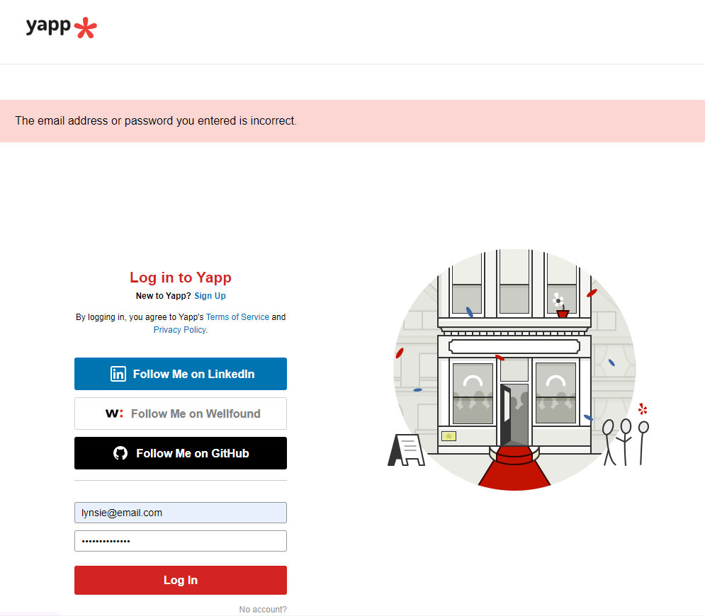
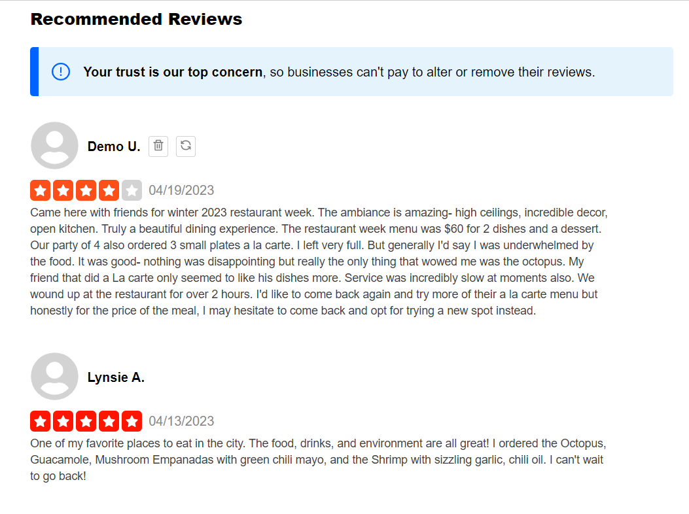

# README

# Yapp 

### Live link: https://yapp.onrender.com

## Background 
July 2024 Update: Yapp is a full stack clone of Yelp, and was the first application I created as a junior full-stack developer in early 2023. After a career change and completing my MVPs, I was proud of the accomplishment of creating my first full-stack project. 

I am most fond of the frontend work I did on this project, as it really showcases my eye for details when developing. I now work as a full-stack developer at Agility Consultants and have learned new ways of developing that are more efficient from how I developed Yapp back in 2023.

## About Yapp
- Yapp allows for a user to search for and review restaurants with full CRUD functionality. 
- To write, update, and delete a review, a user must create an account and/or sign in to their account.
-- A demo-user login option is provided if a user does not wish to create an account, yet still wants to experience the full functionality of Yapp.
- Yapp was developed using Ruby on Rails, PostgreSQL, JavaScript, React, and Redux (thunk). 

## Functionality, Features, MVPs

Yapp has seven core features: 

1. User Authentication & Demo User Account
    - User can create their own account or Login as a Demo User

2. Restaurant reviews 
    - A logged in user has full CRUD capability 
    - A logged out user only has reading capability. If they click on "Write a Review" button, they will be redirected to login page.

3. Google Maps and restaurant location pins
    - Utilizes Google Maps API
    - Renders restaurant seed locations based on restaurant latitude and longitude
4. Search bar and filtering
    - User can search and filter by restaurant name, cuisine, price, or neighborhood
5. Restaurant Index page / Restaurant Show page 

6. Hosting on Render.com
    - https://yapp.onrender.com

7. Production ReadME

## Technologies, Libraries, APIs

- Database: PostgreSQL
- Backend: Ruby on Rails
- Frontend: JavaScript, React, Redux, JSX, DOM Manipulation Vanilla JS, React Icons, Icons 8, Font Awesome

## What I Learned and What I Would Refactor
As I have become a better developer during my time at Agility Consultants, LLC, I have thought about how I would have developed Yapp differently than I did back in 2023.

- Ensure that all error handling for user inputs are handled on the frontend.
-- Currently, there are some validations that are checked solely in Ruby on Rails that can be caught on the frontend instead.
-- This can be done using custom functions in React components, npm packages, or libraries.
- I would change how the Recent Activity data is being assembled by creating a custom SQL query (using Ruby's Active Record) that searches for the 9 most recently created Reviewes, rather than looping through all of my data
-- I made this choice at the time because I was still learning how to make better SQL queries, but now I have a better understanding of how to do so. I also knew that because my application was small, the loop would not slow the application down.
-- If this was a large scale application, I recognize that this approach would not have been ideal.
- I would use more css classes for styling, rather than styling too many individual element Ids on the page. 

## Future Features

- Set up AWS
    - This will allow for: 
        - Independent restaurant banners and thumb nail images 
        - Upload review images 
- User Profile 
    - Will allow users to:
        - Update personal information
        - Access all user's reviews in one place
- Review Reactions
    - Will allow users to react to reviews, deciding if the review was useful, funny, or cool
